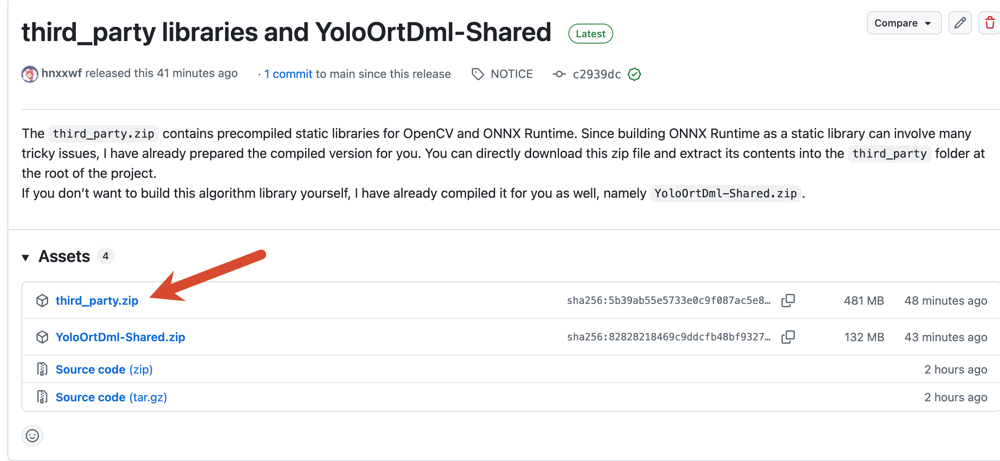

# YOLO-ONNXRuntime-DirectML

**A high-speed YOLO inference library powered by ONNX Runtime and DirectML.**

Language: [简体中文](docs/Chinese.md)

`YoloOrtDml` packages YOLO inference into a C++ shared library. OpenCV and ONNX Runtime are linked as static dependencies, so downstream projects can use the exported CMake package directly and only copy the required runtime DLLs.

## Highlights

- DirectML acceleration for fast YOLO inference on Windows.
- OpenCV and ONNX Runtime static libraries are bundled into `YoloOrtDml`.
- CMake package export with the imported target `YoloOrtDml::YoloOrtDml`.
- Supports YOLOv5, YOLOv6, YOLOv8, YOLOv9, YOLOv10, YOLOv11, YOLOv12, YOLOv13, and YOLOv26.

## Benchmark

| Item | Configuration |
| :-- | :-- |
| GPU | RTX 3060 Laptop |
| CPU | 12th Gen Intel Core i7 |
| Model | YOLOv5n, input size 320, FP16 |
| Image | 320 x 320 |
| Backend | DirectML enabled |

**Measured result:** YOLOv6 can reach around **1 ms** inference latency, while the other supported models are around **1.5 ms**.


## Dependencies

| Dependency / Compiler | Version |
| :-- | :-- |
| OpenCV | 4.12.0 |
| ONNX Runtime | 1.28.0 |
| MSVC | 2022 |

## Model Support

| YOLO Version | Status |
| :-- | :-- |
| YOLOv5 | Supported |
| YOLOv6 | Supported |
| YOLOv8 | Supported |
| YOLOv9 | Supported |
| YOLOv10 | Supported |
| YOLOv11 | Supported |
| YOLOv12 | Supported |
| YOLOv13 | Supported |
| YOLOv26 | Supported |

## Build From Source

> **Prebuilt package:** If you do not want to build the library yourself, download `YoloOrtDml-Shared.zip` from [Releases](https://github.com/hnxxwf/YOLO-ONNXRuntime-DirectML/releases).

This project is built with CMake and Ninja, using MSVC 2022 as the compiler.

OpenCV and ONNX Runtime are required as static libraries, not the official dynamic-library releases. Building these dependencies can be troublesome, especially ONNX Runtime as a static library, so prebuilt static dependencies are provided in `third_party.zip` in [Releases](https://github.com/hnxxwf/YOLO-ONNXRuntime-DirectML/releases).

Extract `third_party.zip` into the `third_party` folder in the project root before building:



> **Runtime note:** After build and install, OpenCV and ONNX Runtime are already linked into `YoloOrtDml`. You do not need to import them again in your own project or copy their runtime DLLs manually. `DirectML.dll` still needs to be copied to the executable directory because it cannot be embedded into `YoloOrtDml`.

Build commands:

```cmd
git clone https://github.com/hnxxwf/YOLO-ONNXRuntime-DirectML.git
cmake -S . -B build -G Ninja -DCMAKE_BUILD_TYPE=Release
cmake --build build
cmake --install build
```

After installation, the packaged `YoloOrtDml` shared library will be generated in the `install` folder in the project root.

## Use In A CMake Project

```cmake
set(YoloOrtDml_Root_Path "Set the root path of the YoloOrtDml shared library folder, for example D:/CodeLibraries/YoloOrtDml-Shared")
set(CMAKE_CXX_STANDARD 17)
set(CMAKE_CXX_STANDARD_REQUIRED ON)
list(APPEND CMAKE_PREFIX_PATH ${YoloOrtDml_Root_Path})

find_package(YoloOrtDml CONFIG REQUIRED)

set(YOLO_APP_TARGET you_executable_target_name)

target_link_libraries(${YOLO_APP_TARGET}
    PRIVATE
        YoloOrtDml::YoloOrtDml
)

# Automatically copy YoloOrtDml.dll and DirectML.dll to the executable directory.
if(YoloOrtDml_RUNTIME_DLLS)
    add_custom_command(TARGET ${YOLO_APP_TARGET} POST_BUILD
        COMMAND ${CMAKE_COMMAND} -E copy_if_different
            ${YoloOrtDml_RUNTIME_DLLS}
            $<TARGET_FILE_DIR:${YOLO_APP_TARGET}>
        VERBATIM
    )
endif()
```

## API Example

```cpp
#include <YoloOrtDml.h>
#include <opencv2/opencv.hpp>
#include <model.h>

#include <iostream>
#include <string>
#include <vector>

int main()
{
    YoloOrtDml detector;
    std::string modelPath = "input model path";
    detector.setModel(modelPath);
    detector.setConfThreshold(0.4f);
    detector.setNmsThreshold(0.45f);

    cv::Mat img = cv::imread("input image path");
    if (img.empty())
    {
        std::cout << "failed to read image" << std::endl;
        return -1;
    }

    detector.preprocess(img);
    detector.infer();

    /*
     * std::vector<DetectResultBox> contains the inference result boxes.
     * You can check model.h to see the structure fields, including the
     * top-left coordinates, width, height, confidence, class id, and class name.
     */
    std::vector<DetectResultBox> resultBoxes = detector.postprocess();

    // You do not have to use draw(). You can also draw boxes from resultBoxes yourself.
    cv::Mat resultMat = detector.draw().clone();
    cv::imshow("YOLO Result", resultMat);
    cv::waitKey(0);
    cv::destroyAllWindows();

    return 0;
}
```
