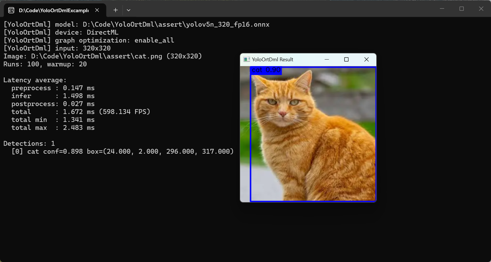

# YOLO-ONNXRuntime-DirectML

**一个基于 ONNX Runtime + DirectML 实现的 YOLO 高速推理库。**

Language: [English](../README.md)

`YoloOrtDml` 将 YOLO 推理封装成 C++ 动态库。OpenCV 和 ONNX Runtime 会以静态库形式打入 `YoloOrtDml`，你的项目可以直接通过导出的 CMake 包接入，只需要复制必要的运行时 DLL。

## 功能特点

- 基于 DirectML 加速，适合 Windows 平台上的高速 YOLO 推理。
- OpenCV 和 ONNX Runtime 静态库已打入 `YoloOrtDml`。
- 提供 CMake 包导出目标 `YoloOrtDml::YoloOrtDml`。
- 支持 YOLOv5、YOLOv6、YOLOv8、YOLOv9、YOLOv10、YOLOv11、YOLOv12、YOLOv13、YOLOv26。

## 测试场景

| 项目 | 配置 |
| :-- | :-- |
| 显卡 | RTX 3060 Laptop |
| CPU | 12 代 i7 |
| 模型 | YOLOv5n，尺寸 320，半精度 FP16 |
| 图片 | 320 x 320 |
| 推理后端 | 已开启 DirectML |

**实测结果：** YOLOv6 可进入 **1 ms** 推理耗时，其他模型都在 **1.5 ms** 左右。



## 依赖版本

| 依赖库与编译器 | 版本 |
| :-- | :-- |
| OpenCV | 4.12.0 |
| ONNX Runtime | 1.28.0 |
| MSVC | 2022 |

## YOLO 模型支持情况

| YOLO 版本 | 支持情况 |
| :-- | :-- |
| YOLOv5 | 支持 |
| YOLOv6 | 支持 |
| YOLOv8 | 支持 |
| YOLOv9 | 支持 |
| YOLOv10 | 支持 |
| YOLOv11 | 支持 |
| YOLOv12 | 支持 |
| YOLOv13 | 支持 |
| YOLOv26 | 支持 |

## 编译构建

> **预编译包：** 如果你不想自行编译，可以直接从 [Releases](https://github.com/hnxxwf/YOLO-ONNXRuntime-DirectML/releases) 下载已经编译好的 `YoloOrtDml-Shared.zip`。

项目使用 CMake + Ninja 构建，编译器使用 MSVC 2022。

项目依赖的 OpenCV 和 ONNX Runtime 是静态库，并不是官方发行的动态库 Release。编译这两个库比较麻烦，尤其是 ONNX Runtime 静态库，所以我已经将编译好的 OpenCV 和 ONNX Runtime 静态库放在 [Releases](https://github.com/hnxxwf/YOLO-ONNXRuntime-DirectML/releases) 中的 `third_party.zip`。

编译前请将 `third_party.zip` 解压到项目根目录下的 `third_party` 文件夹中：


> **运行时说明：** 项目编译并 install 打包后可得到 `YoloOrtDml` 动态库。OpenCV 和 ONNX Runtime 静态库已经打入 `YoloOrtDml`，使用时无需再次导入 OpenCV 和 ONNX Runtime，也无需把它们的运行时 DLL 复制到 exe 目录下。`DirectML.dll` 仍然需要复制到 exe 目录下，因为 DirectML 运行时依赖无法打入 `YoloOrtDml` 动态库。

构建命令：

```cmd
git clone https://github.com/hnxxwf/YOLO-ONNXRuntime-DirectML.git
cmake -S . -B build -G Ninja -DCMAKE_BUILD_TYPE=Release
cmake --build build
cmake --install build
```

运行成功后，项目根目录会生成 `install` 文件夹，里面就是编译打包好的 `YoloOrtDml` 动态库。

## 在 CMake 项目中使用

```cmake
set(YoloOrtDml_Root_Path "填入 YoloOrtDml 动态库文件夹根路径，例如 D:/CodeLibraries/YoloOrtDml-Shared")
set(CMAKE_CXX_STANDARD 17)
set(CMAKE_CXX_STANDARD_REQUIRED ON)
list(APPEND CMAKE_PREFIX_PATH ${YoloOrtDml_Root_Path})

find_package(YoloOrtDml CONFIG REQUIRED)

set(YOLO_APP_TARGET you_executable_target_name)

target_link_libraries(${YOLO_APP_TARGET}
    PRIVATE
        YoloOrtDml::YoloOrtDml
)

# 自动复制 YoloOrtDml.dll 和 DirectML.dll 到 exe 目录下
if(YoloOrtDml_RUNTIME_DLLS)
    add_custom_command(TARGET ${YOLO_APP_TARGET} POST_BUILD
        COMMAND ${CMAKE_COMMAND} -E copy_if_different
            ${YoloOrtDml_RUNTIME_DLLS}
            $<TARGET_FILE_DIR:${YOLO_APP_TARGET}>
        VERBATIM
    )
endif()
```

## 调用接口示例

```cpp
#include <YoloOrtDml.h>
#include <opencv2/opencv.hpp>
#include <model.h>

#include <iostream>
#include <string>
#include <vector>

int main()
{
    YoloOrtDml detector;
    std::string modelPath = "输入模型路径";
    detector.setModel(modelPath);
    detector.setConfThreshold(0.4f);   // 设置置信度阈值
    detector.setNmsThreshold(0.45f);   // 设置 NMS 阈值

    cv::Mat img = cv::imread("输入图片路径");
    if (img.empty())
    {
        std::cout << "图片读取失败" << std::endl;
        return -1;
    }

    detector.preprocess(img);
    detector.infer();

    /*
     * std::vector<DetectResultBox> 是推理结果 box 结构体数组。
     * 你可以打开头文件 model.h 查看具体结构，获取 box 左上角坐标、
     * 宽高、置信度、类别 id、类别名称。
     */
    std::vector<DetectResultBox> resultBoxes = detector.postprocess();

    // 你并不一定非要使用 draw() 函数，也可以根据 resultBoxes 自己绘制 box。
    cv::Mat resultMat = detector.draw().clone();
    cv::imshow("YOLO Result", resultMat);
    cv::waitKey(0);
    cv::destroyAllWindows();

    return 0;
}
```
